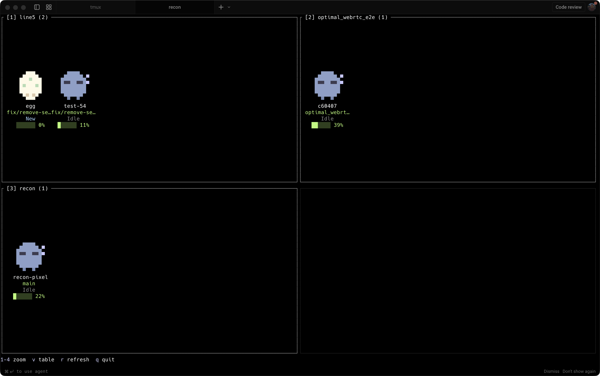

# recon

A TUI dashboard for monitoring [Claude Code](https://claude.ai/claude-code) sessions running inside **tmux**.

See all your Claude sessions at a glance — what they're working on, which need your attention, and how much context they've consumed.

## Views

### Tamagotchi View (`recon view` or press `v`)

A visual dashboard where each agent is a pixel-art creature living in a room. Designed for a side monitor — glance over and instantly see who's working, sleeping, or needs attention.



Creatures are rendered as colored pixel art using half-block characters. Working and Input creatures animate; Idle and New stay still.

| State | Creature | Color |
|-------|----------|-------|
| **Working** | Happy blob with sparkles and feet | Green |
| **Input** | Angry blob with furrowed brows | Orange (pulsing) |
| **Idle** | Sleeping blob with Zzz | Blue-grey |
| **New** | Egg with spots | Cream |

- **Rooms** group agents by working directory (2×2 grid, paginated)
- **Zoom** into a room with `1`-`4`, page with `h`/`l`
- **Context bar** per agent with green/yellow/red coloring

### Table View (default)

```
┌─ recon — Claude Code Sessions ──────────────────────────────────────────────────────────────────────────┐
│  #  Session          Git(Project::Branch)   Directory          Status  Model       Context  Last Active │
│  1  api-refactor     myapp::feat/auth       ~/repos/myapp      ● Input Opus 4.6    45k/1M   2m ago      │
│  2  debug-pipeline   infra::main            ~/repos/infra      ● Work  Sonnet 4.6  12k/200k < 1m        │
│  3  write-tests      myapp::feat/auth       ~/repos/myapp      ● Work  Haiku 4.5   8k/200k  < 1m        │
│  4  code-review      webapp::pr-452         ~/repos/webapp     ● Idle  Sonnet 4.6  90k/200k 5m ago      │
│  5  scratch          recon::main            ~/repos/recon      ● Idle  Opus 4.6    3k/1M    10m ago     │
│  6  new-session      dotfiles::main         ~/repos/dotfiles   ● New   —           —        —           │
└─────────────────────────────────────────────────────────────────────────────────────────────────────────┘
j/k navigate  Enter switch  v view  r refresh  q quit
```

- **Input** rows are highlighted — these sessions are blocked waiting for your approval
- **Working** sessions are actively streaming or running tools
- **Idle** sessions are done and waiting for your next prompt
- **New** sessions haven't had any interaction yet

## How it works

recon is built around **tmux**. Each Claude Code instance runs in its own tmux session.

```
┌─────────────────────────────────────────────────┐
│                    tmux server                   │
│                                                  │
│  ┌─────────────┐  ┌─────────────┐  ┌─────────┐ │
│  │ session:     │  │ session:     │  │ session: │ │
│  │ api-refactor │  │ debug-pipe   │  │ scratch  │ │
│  │              │  │              │  │          │ │
│  │  ┌────────┐  │  │  ┌────────┐  │  │ ┌──────┐ │ │
│  │  │ claude │  │  │  │ claude │  │  │ │claude│ │ │
│  │  └────────┘  │  │  └────────┘  │  │ └──────┘ │ │
│  └──────┬───────┘  └──────┬───────┘  └────┬─────┘ │
│         │                 │               │        │
└─────────┼─────────────────┼───────────────┼────────┘
          │                 │               │
          ▼                 ▼               ▼
    ┌──────────────────────────────────────────┐
    │               recon (TUI)                │
    │                                          │
    │  reads:                                  │
    │   • tmux list-panes → PID, session name  │
    │   • ~/.claude/sessions/{PID}.json        │
    │   • ~/.claude/projects/…/*.jsonl          │
    │   • tmux capture-pane → status bar text  │
    └──────────────────────────────────────────┘
```

**Status detection** inspects the Claude Code TUI status bar at the bottom of each tmux pane:

| Status bar text | State |
|---|---|
| `esc to interrupt` | **Working** — streaming response or running a tool |
| `Esc to cancel` | **Input** — permission prompt, waiting for you |
| anything else | **Idle** — waiting for your next prompt |
| *(0 tokens)* | **New** — no interaction yet |

**Session matching** uses `~/.claude/sessions/{PID}.json` files that Claude Code writes, linking each process to its session ID. No `ps` parsing or CWD-based heuristics.

## Install

```bash
cargo install --path .
```

Requires tmux and [Claude Code](https://claude.ai/claude-code).

## Usage

```bash
recon                                  # Table dashboard
recon view                             # Tamagotchi visual dashboard
recon --json                           # JSON output (for scripting)
recon launch                           # Create a new claude session in the current directory
recon new                              # Interactive new session form
recon resume                           # Interactive resume picker
recon --resume <session-id>            # Resume a claude session in a new tmux session
recon --resume <session-id> --name foo # Resume with a custom tmux session name
```

### Keybindings — Table View

| Key | Action |
|---|---|
| `j` / `k` | Navigate sessions |
| `Enter` | Switch to selected tmux session |
| `x` | Kill selected session |
| `v` | Switch to Tamagotchi view |
| `r` | Force refresh |
| `q` / `Esc` | Quit |

### Keybindings — Tamagotchi View

| Key | Action |
|---|---|
| `1`-`4` | Zoom into room |
| `h` / `l` | Previous / next page |
| `Esc` | Zoom out (or quit) |
| `v` | Switch to table view |
| `r` | Force refresh |
| `q` | Quit |

## tmux config

The included `tmux.conf` provides keybindings to open recon as a popup overlay:

```bash
# Add to your ~/.tmux.conf
bind r display-popup -E -w 80% -h 60% "recon"        # prefix + r → dashboard
bind n display-popup -E -w 80% -h 60% "recon new"    # prefix + n → new session
bind R display-popup -E -w 80% -h 60% "recon resume" # prefix + R → resume picker
bind X confirm-before -p "Kill session #S? (y/n)" kill-session
```

This lets you pop open the dashboard from any tmux session, pick a session with `Enter`, and jump straight to it.

## Features

- **Live status** — polls every 2s, incremental JSONL parsing
- **Tamagotchi view** — pixel-art creatures with animations, rooms, and context bars
- **Git-aware** — shows repo name and branch per session
- **Context tracking** — token usage shown as used/available (e.g. 45k/1M)
- **Model display** — shows which Claude model and effort level
- **Resume picker** — `recon resume` scans JSONL files for past sessions, resume any with `Enter`
- **Multi-session** — handles multiple sessions in the same repo without conflicts
- **JSON mode** — `recon --json` for scripting and automation

## License

MIT
